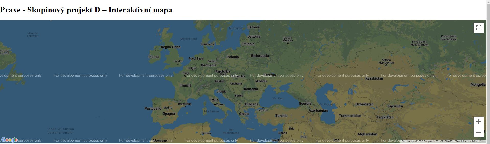
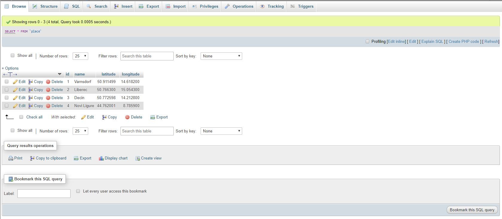

# Praxe Skupinový Projekt D Interaktivní Mapa 
### Snažil jsem se na tom pracovat sám

Provedeno prostřednictvím tutoriálu Google https://developers.google.com/maps/documentation/javascript/mysql-to-maps (což je trochu outdated)

# Problemy

## Mapa

Mapa se vygeneruje, ale chybí body.

## XML

mapmarkers2.php ´´error on line 6 at column 6: XML declaration allowed only at the start of the document´´>  
Opravdu jsem všechno vyzkoušel, ale mě to nefunguje.

## Databaze

## Ve složce ´´Maps´´ najdete index se značkami bez databáze.

### Softwares
Visual Studio Code, XAMMP, PHPMyAdmin,Apache
### Jazyky
HTML, CSS, PHP, JS

