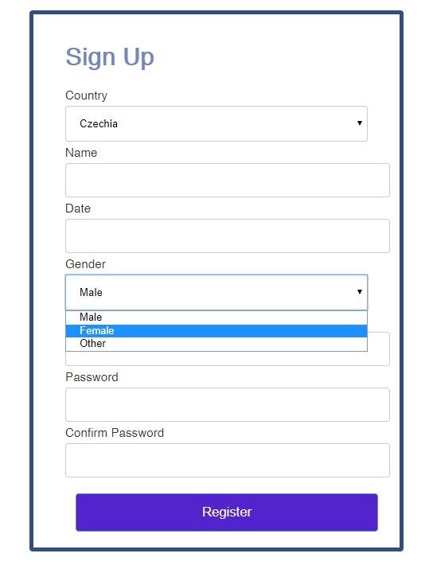

## jQueryUI 

Použitý software: Atom, XAMPP  
Jazyky: PHP (snad), HTML, CSS  
Button ✔  
Controlgroup ~  
Datepicker ✔  
SelectMenu ✔  
Autocomplete X  

## Autocomplete nefunkčnost
 <script>  
 $( function() {  
 var countryList = [  
 "Velmi dlouhý seznam"  
 
div class="field-column"  
 <label>Country</label  
 div  
   input type="text" class="demo-input-box" id="countryList"  
   /div>  
   /div>  
    
